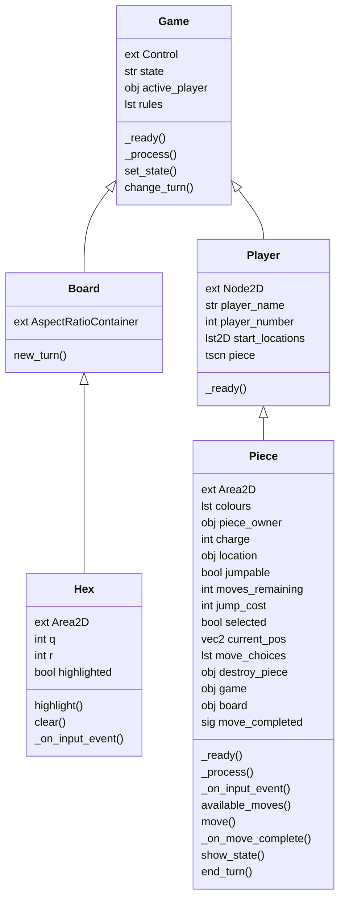

# Game Object Map

```mermaid
classDiagram
    Game <|-- Board
    Game <|-- Player
    Board <|-- Hex
    Player <|-- Piece

    class Game{
        ext Control
        str state
        obj active_player
        lst rules
        _ready()
        _process()
        set_state()
        change_turn()
    }
    class Board{
        ext AspectRatioContainer
        new_turn()
    }
    class Player{
        ext Node2D
        str player_name
        int player_number
        lst2D start_locations
        tscn piece
        _ready()
    }
    class Hex{
        ext Area2D
        int q
        int r
        bool highlighted
        highlight()
        clear()
        _on_input_event()
    }
    class Piece{
        ext Area2D
        lst colours
        obj piece_owner
        int charge
        obj location
        bool jumpable
        int moves_remaining
        int jump_cost
        bool selected
        vec2 current_pos
        lst move_choices
        obj destroy_piece
        obj game
        obj board
        sig move_completed
        _ready()
        _process()
        _on_input_event()
        available_moves()
        move()
        _on_move_complete()
        show_state()
        end_turn()
    }
```
