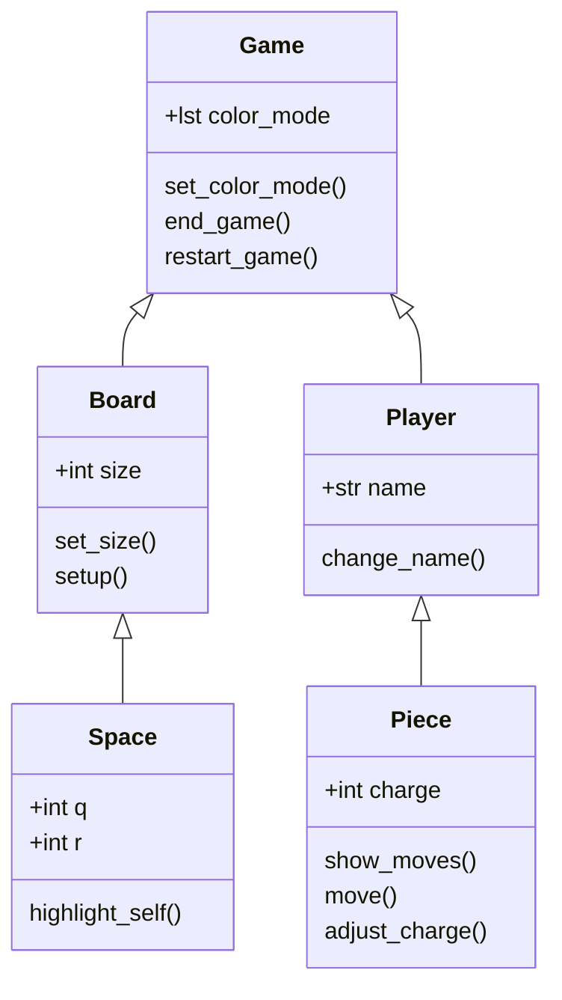

# Game Object Map

```mermaid
classDiagram
    Game <|-- Board
    Game <|-- Player
    Board <|-- Space
    Player <|-- Piece

    class Game{
        +lst color_mode
        set_color_mode()
        end_game()
        restart_game()
    }
    class Board{
        +int size
        set_size()
        setup()
    }
    class Player{
        +str name
        change_name()
    }
    class Space{
        +int q
        +int r
        highlight_self()
    }
    class Piece{
        +int charge
        show_moves()
        move()
        adjust_charge()
    }
```
